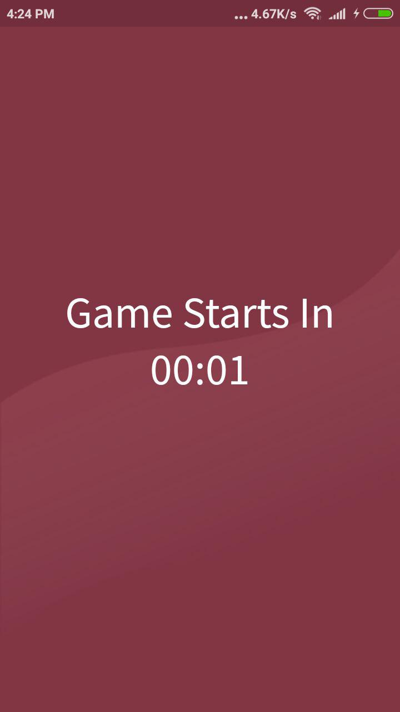

# KryptoQuiz
### Powering **Trivia Games** with **crypto currency**.

With the increasing interest and demand of Trivia Games and their popularity among the trivia fans, we we trilled by the thought to take these experiences to *enhanced*, *secured*, 
and more *engaging* level, with the power of crypto currency.

We build a solution that makes these games as more of an investment for people rather than just playing and earning a fixed amount of money. With the exciting and ever increasing value of the rewards players earn, our system pays player back even after the game.

We introduced crypto currency (**qcoin**) for rewards and payment.
Users will transact in qcoin instead of Fiat currency money or worthless game coins. Hence it will not be discouraging for people to pay and play as they are not loosing real money. People will put qcoins on quizes and earn the same. We will provide certain amount of qcoins for free to new users.

### **Issues in current trivia games**
1. Many games just gives you badges or points of their own which doesn't have any real world value and are Worthless. Also some games let you earn Fiat currency for some investment, but that is hard for people to pay.

2. Games that rewards you with rupee uses third party payment services which leads to many middleman commision, increased transaction failure rate, lack of good customer support, etc.

3. Most trivia games require users to answer all the questions to earn some reward, which discourages people from participating.

4. Games are mostly focused on general questions which is not every one's interest, hence the participation is only limited to a certain group of people.

### **How we solve these issues and what our project features are**
1. We introduced crypto currency (qcoin) for rewards and payment. This will makes it easier for people to pay and earn as they are not loosing real money. People will put qcoins on quizes and earn the same. We will provide certain amount of qcoins for free to new users. 

2. People will put qcoin on quizes and earn definite rewards after a threshold of questions irrespective of the level they reach. Since all the coins will be distributed to all the players as per their performance, there is no middleman which saves on commision, transaction failures and also improves on customer support as there is no third party involvement.

3. Our currency will gain real world value as the user base increases and hence it also becomes a investment for trivia players which will be very motivated for people to invest their time in the games. It will interest players much more in our game rather than games that rewards with worthless game coins or fixed amount of Fiat currency.

4. Since our games will run on qcoins, there is no need for funding or invesments from investors.

5. Brands can do paid promotions of their new products with sponsored quizes which will increase qcoin value, and every player will earn a definite reward.

### **Challenges while making it possible**
1. Building this system in the alloted time of 30 hours was quite challenging as it needed server, database, android application and crypto currency blockchain.
2. Making a unbiased qcoin distribution was problematic so we used Custom Algorithms for solving this.
3. Securing the system was also a challenging part as it required that users should not be able to hack question banks in any way. So we ensured that our application hackproof.
4. Integrating Crypto Currency with NodeJS was fun, explorative and interesting.

### **Screenshots**

### **Notes**
This application is currenly not deployed on cloud server.